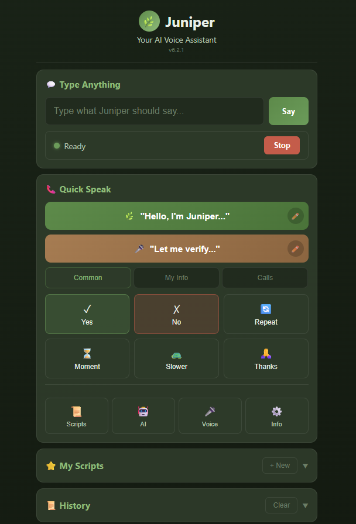

# Juniper Voice Assistant

A voice-activated assistant powered by AI.



## Features

- Voice recognition and natural language processing
- Task automation and smart home integration
- Personalized responses and learning capabilities

## Installation

```bash
npm install
npm start
```

## Usage

Simply speak to Juniper to get started. Say "Hey Juniper" to activate the assistant.

## Contributing

Pull requests are welcome. For major changes, please open an issue first to discuss what you would like to change.

## License

[MIT](LICENSE)
